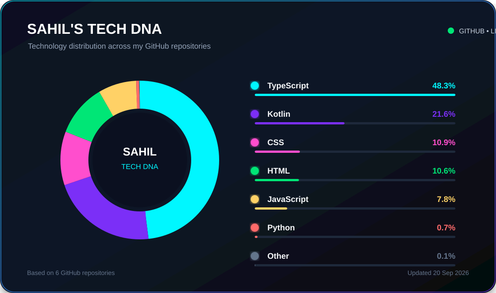

# 👋 Hi, I'm Sahil Singone

### Computer Science Student • AI & Software Builder

 

---

## 👨‍💻 Introduction

I'm **Sahil Singone**, a Computer Science student passionate about building practical software and exploring **AI, automation, and modern product development**.

I'm currently focused on strengthening my foundations in software engineering while building projects that turn ideas into useful products.

* 🎓 Computer Science Student
* 🤖 Exploring **AI, Machine Learning & AI Automation**
* ⚙️ Learning **System Design & Software Engineering**
* 🌐 Building **Web & Software Applications**
* 📱 Exploring **Android Development**
* 🎨 Interested in **UI/UX & Product Design**
* 🚀 Currently building **SpendSense**

---

## 🛠️ Skills & Tech Stack

### 💻 Languages

### 🌐 Development

### ⚙️ Tools

### 🤖 AI & Machine Learning

---

## 🚀 Projects

<table width="100%">

<tr>
<td width="12%" align="center">
<h2>💰</h2>
</td>

<td width="63%">

### 💜 SpendSense

Personal finance management application focused on tracking spending, budgets, and financial insights.

`Kotlin` • `Android` • `Firebase` • `UI/UX`

</td>

<td width="25%" align="center">

<a href="https://github.com/Sahilllz/spendsense">
<b>View Repository →</b>
</a>

</td>
</tr>

<tr>
<td width="12%" align="center">
<h2>📝</h2>
</td>

<td width="63%">

### 🧑‍💻 GitCommitter

A developer-focused project for exploring GitHub commit activity, statistics, and contribution insights.

`TypeScript` • `Next.js` • `MongoDB` • `Chart.js`

</td>

<td width="25%" align="center">

<a href="https://github.com/Sahilllz">
<b>View Repository →</b>
</a>

</td>
</tr>

<tr>
<td width="12%" align="center">
<h2>🧪</h2>
</td>

<td width="63%">

### 🧪 TypeLabs

A collection of TypeScript experiments, utilities, and developer-focused projects.

`TypeScript` • `Vite` • `Tailwind CSS`

</td>

<td width="25%" align="center">

<a href="https://github.com/Sahilllz">
<b>View Repository →</b>
</a>

</td>
</tr>

</table>

---

---

---

## 🧬 My Tech DNA

 

Automatically generated from my GitHub repositories • Updated weekly

## 🌐 Let's Connect

  

`Open to learning • Building • Collaborating`

---

## 💡 Philosophy

> **Don't just learn technology. Build something with it.**

 

`Learn` → `Build` → `Experiment` → `Break` → `Fix` → `Improve` → `Ship`

  

### ⚡ Learn • Build • Ship • Repeat

